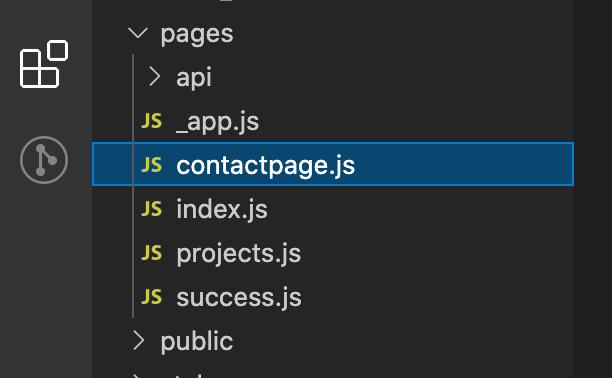
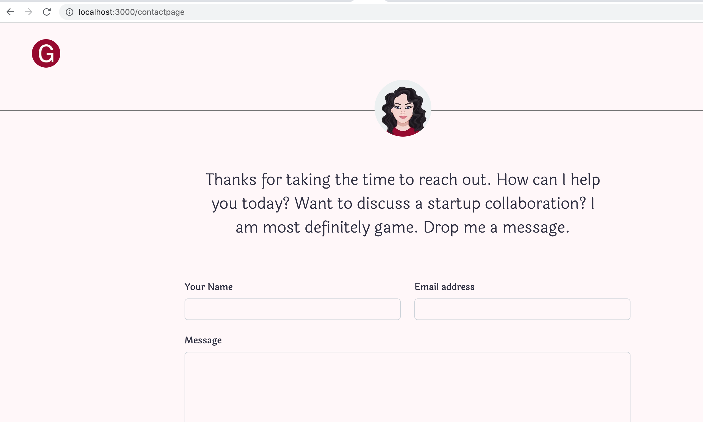
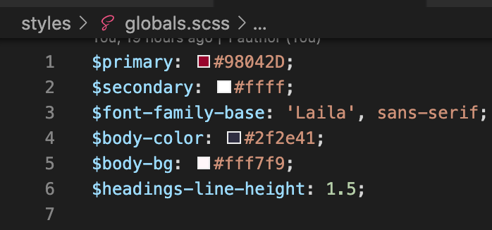
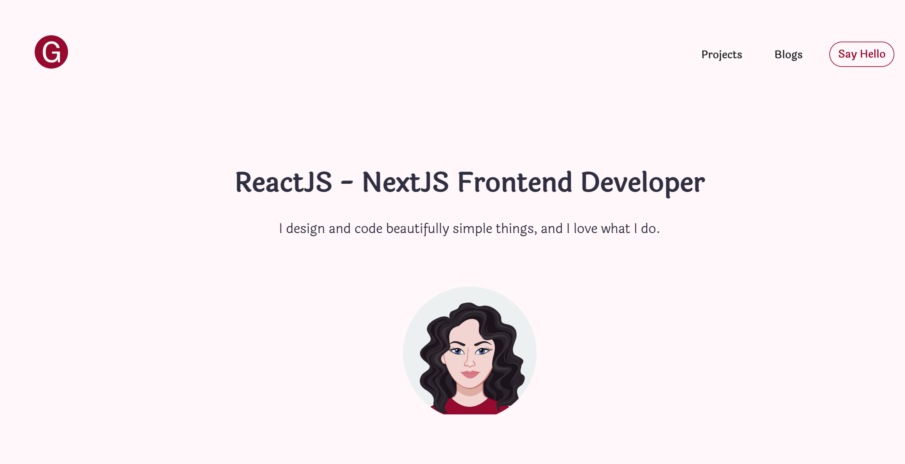
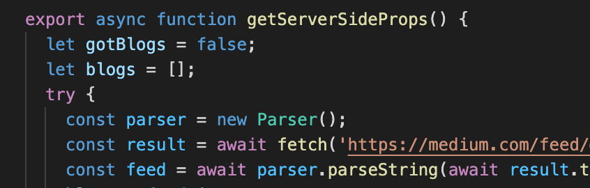
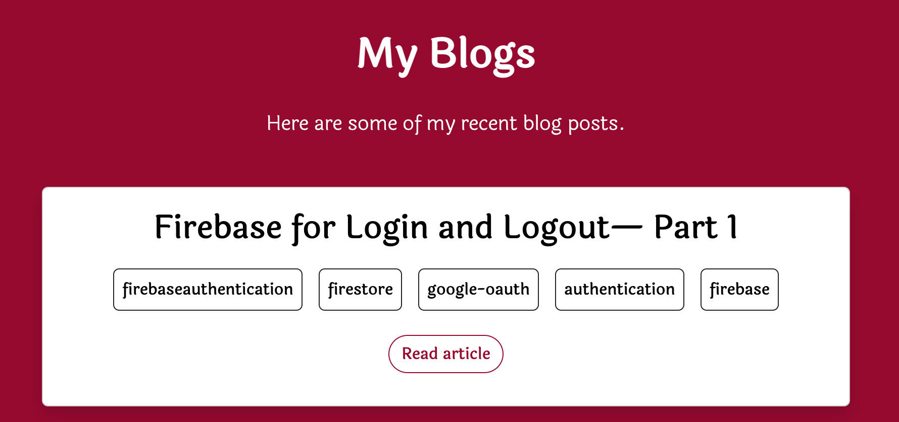
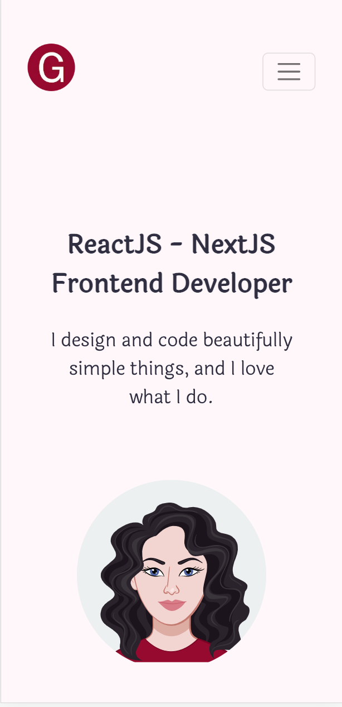
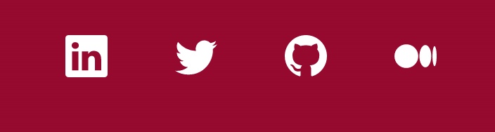

<h1>Portfolio Website</h1>

This is my personal website showcasing some of my recent work

<h2>Purpose and Goal</h2>
 

I wanted to upgrade my existing website and make it more modern/polished. 

I have tried to implement some of the learnings from NextJS and Bootstrap into this website

#### Features:
- [x] Responsive layout
- [x] Server-side APIs for Medium & Google Sheets
- [x] Hosted using Vercel
- [x] Google Analytics
- [ ] CI/CD pipeline with Github Actions
- [ ] Automated Testing  
- [ ] Performance debugging and optimization

<h2>Web Stack and Explanation</h2>
 

<strong>NextJS:</strong> My last project was based on React but this website is developed using NextJS. The reason for using NextJS is that it is simple to implement and comes with many added features. Some features that I have implemented are:
 
<ul>
<li>File-system based routing: I have added all files that need routing under pages.

 
</li>
<li>
Built-in scss support to extend css used by Bootstrap

 
</li>
<li>Server-side APIs to fetch blogs

 
</li>
</ul>
 

<strong>Bootstrap 5:</strong>
<ul>
<li> It was easy to implement a responsive layout using bootstrap components and classes (Flexbox and Grid). 

 
</li>
<li>I have also used bootstrap icons.

</li></ul>

<h2>Resources</h2>
 
<ul>
<li>For generating Avatar: https://avatarmaker.com/ </li>
<li>For creating illustration this is placed on the space below avatar: https://undraw.co/illustrations </li>
<li>For favicon and logo generator I have used site: https://favicon.io/</li>
<li>For deciding on colours and checking its contrast/readability I have used color-wheel by adobe: https://color.adobe.com/create/color-wheel </li>
<li>And for fonts: https://fonts.google.com/ </li>
</ul>

